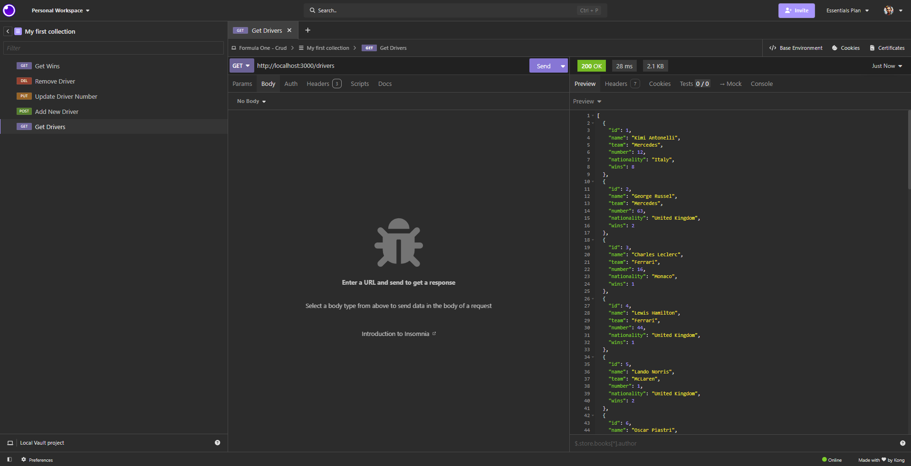
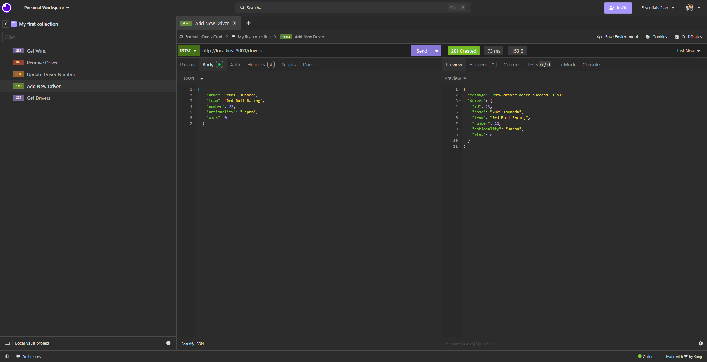
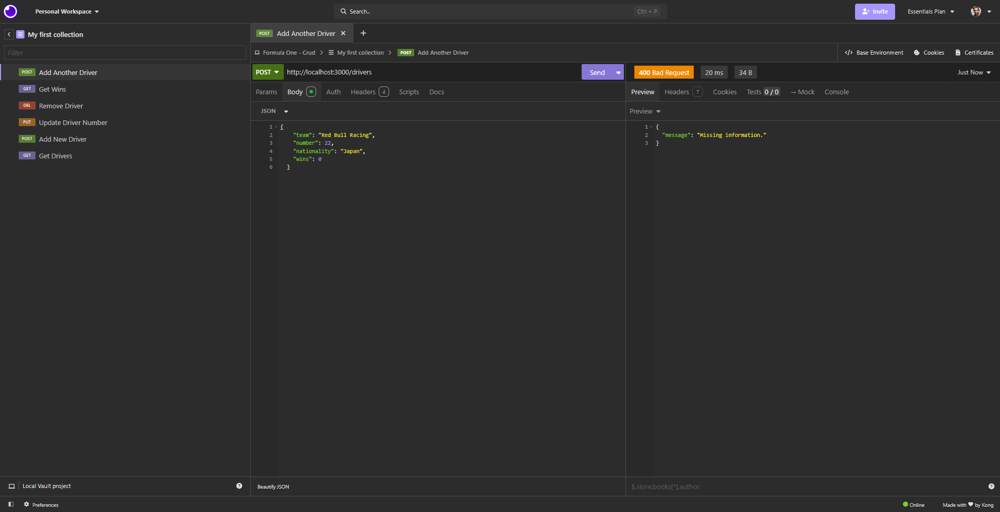
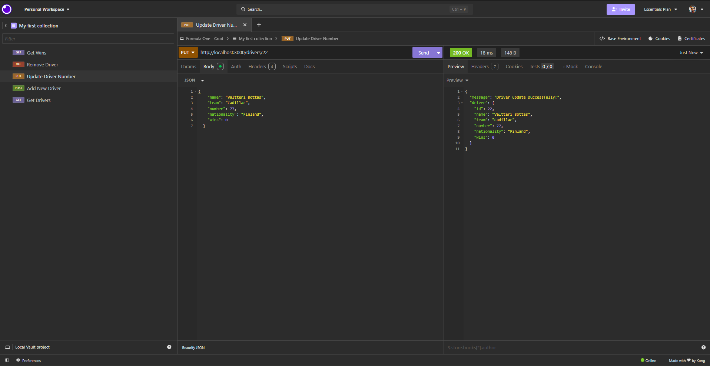
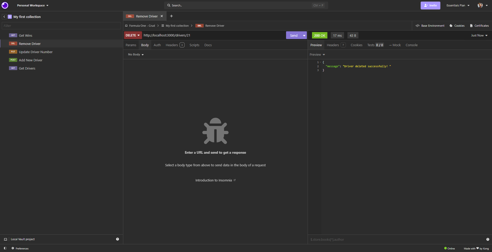
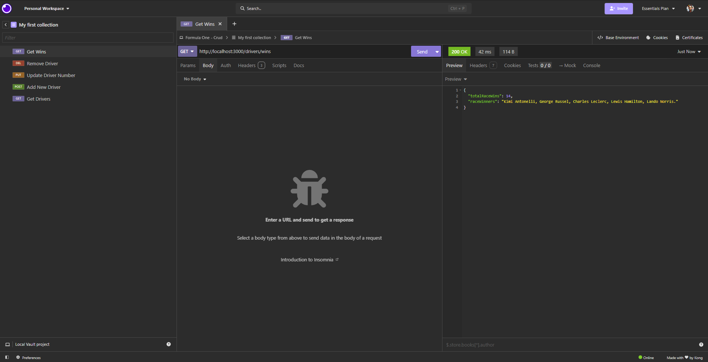

## 01 - Drivers route "/drivers"

- **Method:** GET
- **Path:** "/drivers"
- **Request body:** none
- **Returns:** an array of all the drivers
- **Success response — 200 OK**

## 02 - Add new driver "/drivers"

- **Method:** POST
- **Path:** "/drivers"
- **Request body:** a driver object matching the existing pattern
- **Returns:** an object of that driver with new id
- **Success response — 201 Created**

- **Error response — 400 Bad Request**

## 03 - Update Driver Number "/drivers/22"

- **Method:** PUT
- **Path:** "/drivers/22"
- **Request body:** a driver object matching the id with updated information
- **Returns:** an updated object of the driver
- **Success response — 200 OK**

## 04 - Remove Driver "/drivers/21"

- **Method:** DELETE
- **Path:** "/drivers/21"
- **Request body:** none
- **Returns:** a message confirming deletion
- **Success response — 200 OK**

## 05 - Drivers Wins Route "/drivers/wins"

- **Method:** GET
- **Path:** "/drivers/wins"
- **Request body:** none
- **Returns:** an object with win data
- **Success response — 200 OK**

